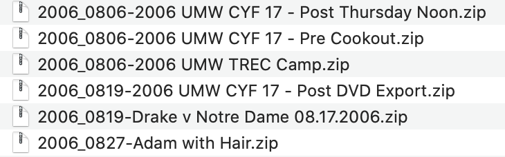
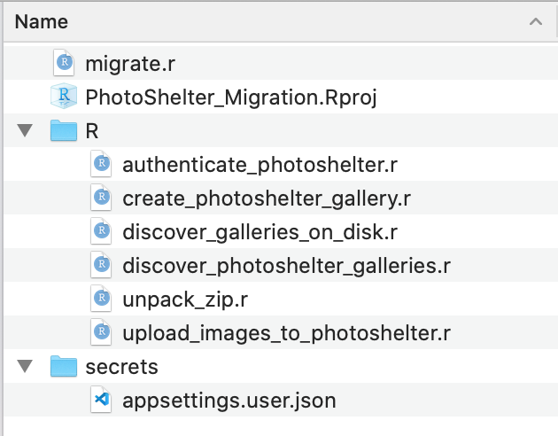
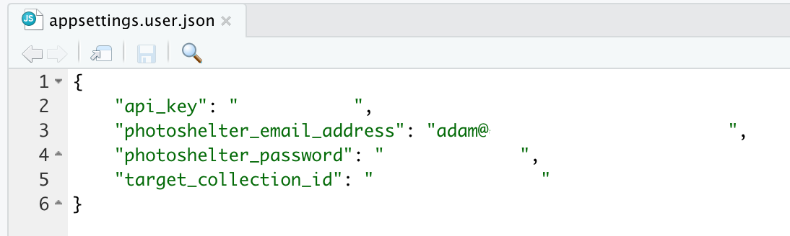

# Migrate Galleries to PhotoShelter
Standalone R project to migrate on-disk galleries to PhotoShelter via API  

# Introduction
This stand-alone R project is meant to aid in migrating photo galleries to the commercial hosting service, PhotoShelter (https://www.photoshelter.com).   The creator of this project has no relationship with PhotoShelter other than being an enthusiastic and appreciative customer.  
  
This stand-alone R project is a _project_ and not an R package, largely because its functioning is highly-dependent on the end-user's local storage of photo galleries.  

# Setup
## Galleries
This project assumes you have all galleries you want to upload in individual zipped files.  Each gallery the script creates in PhotoShelter will be named identical to the zip file name (without extension).  

## R Project
After downloading the project and ensuring that R and all required packages are installed (newer versions of RStudio will prompt after opening the project), open the **migrate.r** file.  On line 9, specify the local directory location containing the zip files to upload; specify it in the _parent_dir_ argument.  

## Local Secrets
The script assumes you have a local directory called **secrets**.  Within it should be a json file called **appsettings.user.json**  
 

## API Key
You will need not only a PhotoShelter account, but also an API key: [Request an API Key](https://www.photoshelter.com/developer/index/register/api_key)  
  
## Parent Collection
To have a destination to upload galleries, you need to specify a Photoshelter collection.  Create this first in the PhotoShelter website, and then use an API tool such as [Postman](https://www.postman.com) to list the collections in your account.  
1. Authenticate via https://www.photoshelter.com/psapi/v3/mem/authenticate  
2. Use the auth token and query the existing collections via https://www.photoshelter.com/psapi/v3/mem/collection/root/children  
3. For the desired parent collection, put this _collection_id_ value in your appsettings.user.json file  
  
# Other Notes
## Recovery
This script assumes something will go wrong in the creation/uploading of galleries (Internet connections may drop, galleries may have corrupt image files, etc).  The anti_join() step on line 15 of the migrate.r script will cause it to skip any gallery that already exists in PhotoShelter and not re-upload it.  If there was a failure, the easiest remedy is to manually delete the gallery in PhotoShelter and run the script again.

